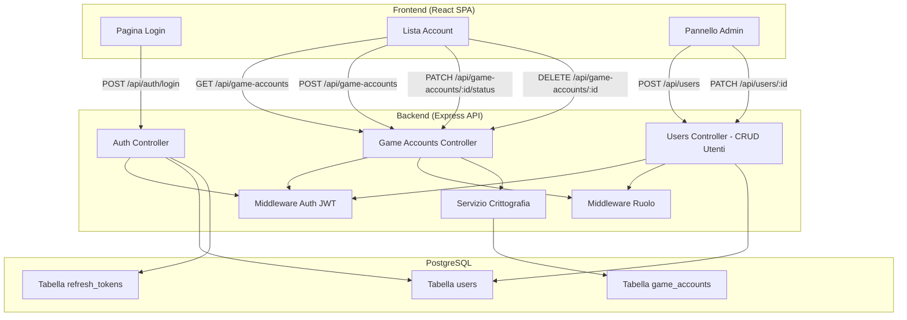
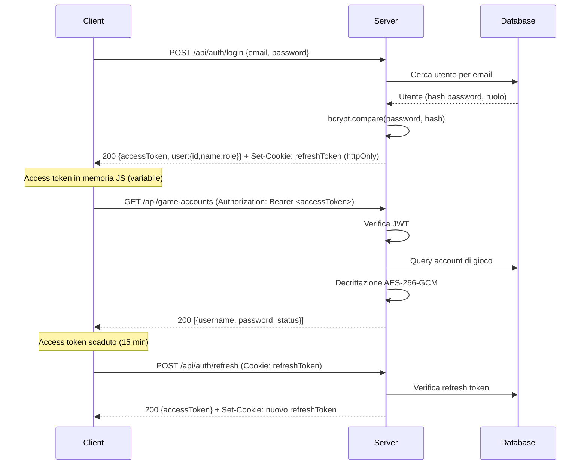
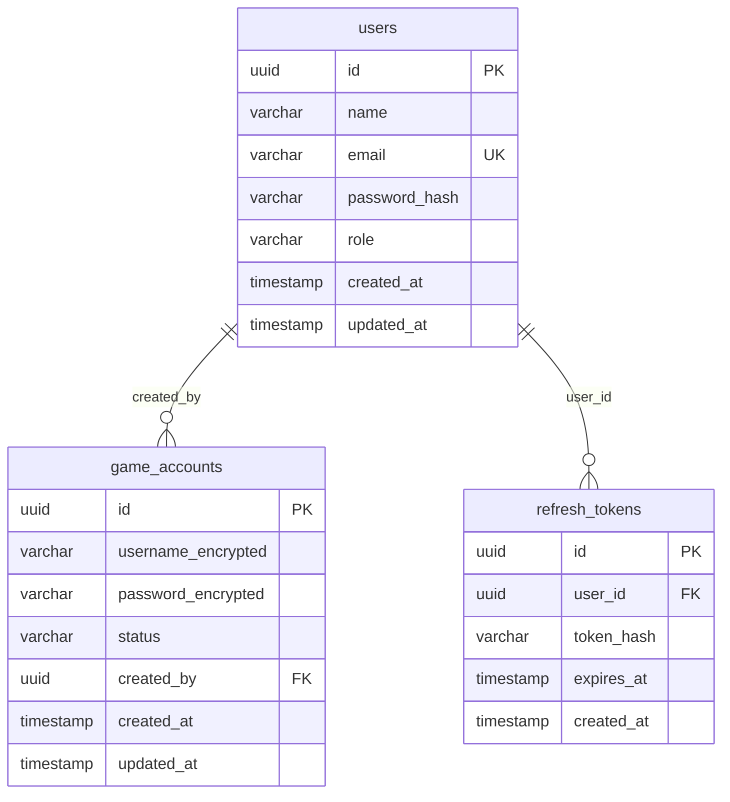

# Documento di Design — Web App Auth (Gestione Gilda Metin2)

## Panoramica

Questa applicazione web consente ai membri di una gilda di Metin2 di condividere e gestire le credenziali degli account di gioco. Il sistema prevede due ruoli (admin e utente semplice), autenticazione tramite JWT, e un'architettura client-server con API REST protette.

L'admin crea manualmente gli account utente (nessuna registrazione pubblica). Tutti gli utenti autenticati possono visualizzare, aggiungere account condivisi e cambiarne lo stato online/offline. Solo l'admin può eliminare account condivisi, gestire le utenze e modificare gli account utente esistenti. La pagina di login è la landing page per utenti non autenticati.

### Stack Tecnologico

| Componente | Tecnologia | Motivazione |
|---|---|---|
| Frontend | React + Vite | SPA leggera, ecosistema maturo, compatibile con hosting gratuito |
| Backend | Node.js + Express | Veloce da sviluppare, ampio supporto librerie sicurezza |
| Database | PostgreSQL (Supabase/Neon free tier) | Relazionale, gratuito, hosting cloud |
| Autenticazione | JWT (access + refresh token) | Stateless, sicuro se implementato correttamente |
| Hashing password | bcrypt | Standard industriale per hashing password |
| Crittografia credenziali gioco | AES-256-GCM (server-side) | Le credenziali di gioco devono essere recuperabili ma protette a riposo |
| Hosting | Render / Railway (free tier) | Compatibile con Node.js, deploy semplice |

### Decisioni di Design Chiave

1. **Le credenziali di gioco (Account_Condiviso) sono crittografate a riposo** con AES-256-GCM. La chiave di crittografia è una variabile d'ambiente server-side, mai esposta al client.
2. **Le password utente sono hashate con bcrypt** e mai recuperabili.
3. **JWT con doppio token**: access token (breve durata, 15 min) in memoria JS + refresh token (httpOnly cookie, 7 giorni). Nessun token in localStorage.
4. **Nessun dato sensibile nel DOM/console**: le credenziali di gioco vengono decrittate server-side e inviate al frontend solo via API protetta su HTTPS. Il frontend le mostra ma non le persiste.
5. **Autorizzazione server-side**: ogni endpoint verifica ruolo e sessione. Il frontend nasconde i pulsanti admin, ma la vera protezione è lato server.

## Architettura

### Diagramma Architetturale



### Flusso di Autenticazione




## Componenti e Interfacce

### API REST — Endpoints

#### Autenticazione

| Metodo | Endpoint | Accesso | Descrizione |
|---|---|---|---|
| POST | `/api/auth/login` | Pubblico | Login con email e password |
| POST | `/api/auth/refresh` | Cookie httpOnly | Rinnovo access token |
| POST | `/api/auth/logout` | Autenticato | Logout e invalidazione refresh token |

#### Account di Gioco (Game Accounts)

| Metodo | Endpoint | Accesso | Descrizione |
|---|---|---|---|
| GET | `/api/game-accounts` | Autenticato | Lista tutti gli account condivisi |
| POST | `/api/game-accounts` | Autenticato | Aggiunge un nuovo account condiviso |
| PATCH | `/api/game-accounts/:id/status` | Autenticato | Toggle stato online/offline |
| DELETE | `/api/game-accounts/:id` | Solo Admin | Elimina un account condiviso |

#### Gestione Utenti (Admin)

| Metodo | Endpoint | Accesso | Descrizione |
|---|---|---|---|
| POST | `/api/users` | Solo Admin | Crea un nuovo account utente |
| GET | `/api/users` | Solo Admin | Lista utenti del sistema |
| PATCH | `/api/users/:id` | Solo Admin | Modifica un account utente esistente (nome, email, password, ruolo) |

### Componenti Frontend (React)

| Componente | Responsabilità |
|---|---|
| `LoginPage` | Form di login, gestione errori credenziali. È la landing page predefinita per utenti non autenticati |
| `AccountList` | Tabella account condivisi con toggle stato e pulsante elimina (se admin) |
| `AddAccountForm` | Modale/form per aggiungere un nuovo account condiviso |
| `AdminPanel` | Pagina creazione e modifica utenti, visibile solo ad admin. Mostra la lista utenti con opzione di modifica (nome, email, password, ruolo) per ciascuno |
| `ProtectedRoute` | Wrapper che verifica autenticazione e ruolo |
| `AuthContext` | Context React per stato autenticazione (access token in memoria, ruolo utente) |

### Routing Frontend

| Path | Componente | Accesso | Note |
|---|---|---|---|
| `/` | Redirect → `/login` | Pubblico | La root reindirizza sempre alla pagina di login |
| `/login` | `LoginPage` | Pubblico | Landing page per utenti non autenticati. Se già autenticato, redirect a `/accounts` |
| `/accounts` | `AccountList` | Autenticato (ProtectedRoute) | Pagina principale dopo il login |
| `/admin` | `AdminPanel` | Solo Admin (ProtectedRoute) | Gestione creazione e modifica utenti |

Se un utente non autenticato tenta di accedere a qualsiasi rotta protetta, viene reindirizzato a `/login`.

### Middleware Backend

| Middleware | Responsabilità |
|---|---|
| `authMiddleware` | Verifica validità JWT access token da header Authorization |
| `roleMiddleware(role)` | Verifica che l'utente abbia il ruolo richiesto (es. 'admin') |
| `validateInput` | Sanitizzazione e validazione input con express-validator |
| `rateLimiter` | Rate limiting su endpoint sensibili (login, creazione utenti) |

### Interfacce dei Servizi

```typescript
// Servizio Autenticazione
interface AuthService {
  login(email: string, password: string): Promise<{ accessToken: string; user: UserInfo }>;
  refresh(refreshToken: string): Promise<{ accessToken: string; newRefreshToken: string }>;
  logout(refreshToken: string): Promise<void>;
  hashPassword(password: string): Promise<string>;
  verifyPassword(password: string, hash: string): Promise<boolean>;
}

// Servizio Account di Gioco
interface GameAccountService {
  getAll(): Promise<GameAccountDTO[]>;
  create(data: CreateGameAccountInput): Promise<GameAccountDTO>;
  toggleStatus(id: string): Promise<GameAccountDTO>;
  delete(id: string): Promise<void>;
}

// Servizio Crittografia
interface CryptoService {
  encrypt(plaintext: string): string;   // AES-256-GCM
  decrypt(ciphertext: string): string;  // AES-256-GCM
}

// Servizio Utenti
interface UserService {
  create(data: CreateUserInput): Promise<UserDTO>;
  update(id: string, data: UpdateUserInput): Promise<UserDTO>;
  findByEmail(email: string): Promise<User | null>;
  getAll(): Promise<UserDTO[]>;
}
```

### Interfacce DTO

```typescript
interface UserInfo {
  id: string;
  name: string;
  email: string;
  role: 'admin' | 'user';
}

interface UserDTO {
  id: string;
  name: string;
  email: string;
  role: 'admin' | 'user';
  createdAt: string;
}

interface CreateUserInput {
  name: string;
  email: string;
  password: string;
  role: 'admin' | 'user';
}

interface UpdateUserInput {
  name?: string;
  email?: string;
  password?: string;
  role?: 'admin' | 'user';
}

interface GameAccountDTO {
  id: string;
  username: string;
  password: string;  // decrittata server-side prima dell'invio
  status: 'online' | 'offline';
  createdBy: string;
  createdAt: string;
}

interface CreateGameAccountInput {
  username: string;
  password: string;
}
```

## Modelli Dati

### Schema Database (PostgreSQL)



### Dettaglio Tabelle

#### `users`
| Colonna | Tipo | Vincoli | Note |
|---|---|---|---|
| id | UUID | PK, default gen_random_uuid() | |
| name | VARCHAR(100) | NOT NULL | |
| email | VARCHAR(255) | NOT NULL, UNIQUE | Indice per lookup veloce |
| password_hash | VARCHAR(255) | NOT NULL | Hash bcrypt (salt rounds: 12) |
| role | VARCHAR(10) | NOT NULL, CHECK (role IN ('admin','user')) | Default: 'user' |
| created_at | TIMESTAMP | NOT NULL, DEFAULT NOW() | |
| updated_at | TIMESTAMP | NOT NULL, DEFAULT NOW() | |

#### `game_accounts`
| Colonna | Tipo | Vincoli | Note |
|---|---|---|---|
| id | UUID | PK, default gen_random_uuid() | |
| username_encrypted | TEXT | NOT NULL | Crittografato AES-256-GCM (iv:tag:ciphertext) |
| password_encrypted | TEXT | NOT NULL | Crittografato AES-256-GCM (iv:tag:ciphertext) |
| status | VARCHAR(10) | NOT NULL, CHECK (status IN ('online','offline')) | Default: 'offline' |
| created_by | UUID | FK → users(id) | Chi ha aggiunto l'account |
| created_at | TIMESTAMP | NOT NULL, DEFAULT NOW() | |
| updated_at | TIMESTAMP | NOT NULL, DEFAULT NOW() | |

#### `refresh_tokens`
| Colonna | Tipo | Vincoli | Note |
|---|---|---|---|
| id | UUID | PK, default gen_random_uuid() | |
| user_id | UUID | FK → users(id), NOT NULL | |
| token_hash | VARCHAR(255) | NOT NULL | Hash SHA-256 del refresh token |
| expires_at | TIMESTAMP | NOT NULL | Scadenza 7 giorni |
| created_at | TIMESTAMP | NOT NULL, DEFAULT NOW() | |

### Formato Crittografia AES-256-GCM

I campi `username_encrypted` e `password_encrypted` sono memorizzati nel formato:

```
<iv_hex>:<auth_tag_hex>:<ciphertext_hex>
```

- **IV**: 12 byte random, unico per ogni operazione di crittografia
- **Auth Tag**: 16 byte, garantisce integrità e autenticità
- **Ciphertext**: il dato crittografato
- **Chiave**: variabile d'ambiente `ENCRYPTION_KEY` (32 byte / 256 bit), mai nel codice sorgente


## Proprietà di Correttezza

*Una proprietà è una caratteristica o un comportamento che deve essere vero in tutte le esecuzioni valide di un sistema — essenzialmente, un'affermazione formale su ciò che il sistema deve fare. Le proprietà fungono da ponte tra specifiche leggibili dall'uomo e garanzie di correttezza verificabili dalla macchina.*

### Proprietà 1: Login valido produce sessione valida

*Per qualsiasi* coppia di credenziali valide (email e password corrispondenti a un utente nel database), il login deve restituire un access token JWT valido e impostare un refresh token come cookie httpOnly.

**Valida: Requisiti 1.1, 1.4**

### Proprietà 2: Credenziali non valide restituiscono errore generico

*Per qualsiasi* coppia di credenziali non valide (email inesistente, password errata, o entrambe), il sistema deve restituire lo stesso messaggio di errore generico "Credenziali non valide" con status 401, senza rivelare quale campo è errato.

**Valida: Requisito 1.2**

### Proprietà 3: Login restituisce il ruolo corretto

*Per qualsiasi* utente con un ruolo assegnato (admin o user), dopo un login riuscito, il campo `role` nella risposta deve corrispondere esattamente al ruolo memorizzato nel database.

**Valida: Requisito 1.3**

### Proprietà 4: Token valido garantisce accesso

*Per qualsiasi* access token JWT valido e non scaduto, le richieste agli endpoint protetti devono restituire status 200 (o il codice appropriato per l'operazione), mai 401.

**Valida: Requisito 2.1**

### Proprietà 5: Logout invalida la sessione

*Per qualsiasi* utente autenticato, dopo aver chiamato l'endpoint di logout, il refresh token precedente deve essere invalidato: un tentativo di refresh con quel token deve fallire con 401.

**Valida: Requisito 2.2**

### Proprietà 6: Token scaduto viene rifiutato

*Per qualsiasi* access token JWT scaduto, le richieste agli endpoint protetti devono restituire status 401.

**Valida: Requisito 2.3**

### Proprietà 7: Utente autenticato riceve tutti gli account con campi completi

*Per qualsiasi* insieme di account di gioco nel database e qualsiasi utente autenticato, la risposta GET deve contenere tutti gli account, e ogni account deve includere i campi `username`, `password` (decrittata) e `status`.

**Valida: Requisiti 3.1, 3.2, 3.3**

### Proprietà 8: Nuovo account di gioco ha stato predefinito offline

*Per qualsiasi* coppia valida di username e password di gioco, quando viene creato un nuovo account condiviso, il campo `status` deve essere impostato a "offline".

**Valida: Requisito 4.2**

### Proprietà 9: Campi obbligatori mancanti vengono rifiutati

*Per qualsiasi* input di creazione account di gioco dove username o password è vuoto, nullo o composto solo da spazi, il sistema deve rifiutare la richiesta con un errore di validazione (status 400) e non creare alcun record nel database.

**Valida: Requisito 4.3**

### Proprietà 10: Toggle stato è un'involuzione

*Per qualsiasi* account di gioco con qualsiasi stato (online o offline), applicare il toggle due volte deve riportare lo stato al valore originale. Inoltre, toggle("online") == "offline" e toggle("offline") == "online".

**Valida: Requisito 5.1**

### Proprietà 11: Enforcement autorizzazione basata su ruolo

*Per qualsiasi* richiesta non autenticata a qualsiasi endpoint protetto, il sistema deve restituire 401. *Per qualsiasi* richiesta autenticata con ruolo "user" agli endpoint riservati all'admin (DELETE game-accounts, POST users, PATCH users/:id), il sistema deve restituire 403.

**Valida: Requisiti 6.2, 8.1, 8.2**

### Proprietà 12: Eliminazione admin rimuove l'account

*Per qualsiasi* account di gioco esistente, quando un admin lo elimina, l'account non deve più apparire nella lista restituita da GET /api/game-accounts.

**Valida: Requisito 6.4**

### Proprietà 13: Admin può creare utenti

*Per qualsiasi* input valido di creazione utente (nome, email unica, password, ruolo), quando un admin crea l'utente, il nuovo utente deve esistere nel database e poter effettuare il login con le credenziali fornite.

**Valida: Requisito 7.2**

### Proprietà 14: Email duplicata viene rifiutata

*Per qualsiasi* email già associata a un utente esistente, un tentativo di creare un nuovo utente con la stessa email deve fallire con errore "Email già in uso" (status 409) e non creare alcun record duplicato.

**Valida: Requisito 7.3**

### Proprietà 15: Password memorizzate come hash bcrypt

*Per qualsiasi* utente creato nel sistema, il valore `password_hash` nel database non deve mai essere uguale alla password in chiaro, e deve essere un hash bcrypt valido (prefisso `$2b$`).

**Valida: Requisito 9.1**

### Proprietà 16: Round-trip crittografia credenziali di gioco

*Per qualsiasi* stringa di testo (username o password di gioco), crittografare con AES-256-GCM e poi decrittare deve restituire esattamente la stringa originale.

**Valida: Requisiti 3.2, 9.1 (protezione dati a riposo)**

### Proprietà 17: Utenti non autenticati vengono reindirizzati al login

*Per qualsiasi* rotta protetta della WebApp, se un utente non autenticato tenta di accedervi, il sistema deve reindirizzarlo alla pagina di login (`/login`). La pagina di login è la landing page predefinita.

**Valida: Requisito 1.1**

### Proprietà 18: Admin può modificare utenti esistenti (round-trip)

*Per qualsiasi* utente esistente e qualsiasi modifica valida ai campi (nome, email, password, ruolo), quando un admin aggiorna l'utente tramite PATCH `/api/users/:id`, una successiva richiesta GET deve restituire i dati aggiornati. Se la password viene modificata, l'utente deve poter effettuare il login con la nuova password.

**Valida: Requisito 7.6**

### Proprietà 19: Email duplicata rifiutata anche in modifica

*Per qualsiasi* coppia di utenti esistenti, se un admin tenta di modificare l'email del primo utente impostandola uguale all'email del secondo, il sistema deve restituire errore 409 "Email già in uso" e non modificare alcun dato.

**Valida: Requisito 7.7**


## Gestione Errori

### Strategia Generale

Tutti gli errori vengono gestiti con un middleware Express centralizzato che:
- Restituisce risposte JSON strutturate con formato consistente
- Non espone mai dettagli interni (stack trace, query SQL, nomi tabelle) al client
- Logga i dettagli completi server-side per debugging

### Formato Risposta Errore

```json
{
  "error": {
    "message": "Messaggio leggibile dall'utente",
    "code": "ERROR_CODE"
  }
}
```

### Tabella Errori per Endpoint

| Scenario | Status HTTP | Codice Errore | Messaggio |
|---|---|---|---|
| Credenziali login non valide | 401 | INVALID_CREDENTIALS | Credenziali non valide |
| Token JWT mancante o non valido | 401 | UNAUTHORIZED | Autenticazione richiesta |
| Token JWT scaduto | 401 | TOKEN_EXPIRED | Sessione scaduta |
| Refresh token non valido/scaduto | 401 | INVALID_REFRESH_TOKEN | Sessione scaduta, effettua nuovamente il login |
| Ruolo insufficiente (non admin) | 403 | FORBIDDEN | Permessi insufficienti |
| Campi obbligatori mancanti | 400 | VALIDATION_ERROR | Campi obbligatori mancanti: [lista campi] |
| Email già in uso | 409 | DUPLICATE_EMAIL | Email già in uso |
| Account di gioco non trovato | 404 | NOT_FOUND | Risorsa non trovata |
| Utente non trovato (modifica) | 404 | NOT_FOUND | Risorsa non trovata |
| Errore database | 500 | INTERNAL_ERROR | Errore interno del server |
| Rate limit superato | 429 | RATE_LIMITED | Troppe richieste, riprova più tardi |

### Sicurezza nella Gestione Errori

- **Login**: messaggio generico "Credenziali non valide" sia per email inesistente che per password errata (previene enumerazione utenti)
- **Errori 500**: mai esporre dettagli tecnici al client. Il messaggio è sempre generico.
- **Validazione input**: i messaggi indicano quali campi sono mancanti, ma non espongono la struttura interna del database

### Gestione Errori Frontend

| Scenario | Comportamento UI |
|---|---|
| Errore login | Mostra messaggio sotto il form, non cancella i campi |
| Errore creazione account gioco | Mostra toast/banner di errore, mantiene i dati nel form |
| Errore toggle stato | Ripristina il toggle allo stato precedente, mostra toast |
| Errore eliminazione | Mostra toast di errore, l'account resta nella lista |
| Errore modifica utente | Mostra toast di errore, i dati dell'utente restano invariati nel form |
| Token scaduto (401) | Tenta refresh automatico; se fallisce, redirect a login |
| Errore rete | Mostra messaggio "Errore di connessione, riprova" |

## Strategia di Testing

### Approccio Duale

Il testing combina due approcci complementari:

1. **Unit test**: verificano esempi specifici, edge case e condizioni di errore
2. **Property-based test**: verificano proprietà universali su input generati casualmente

Insieme garantiscono copertura completa: gli unit test catturano bug concreti, i property test verificano la correttezza generale.

### Librerie e Configurazione

| Strumento | Uso |
|---|---|
| **Jest** | Framework di test principale |
| **fast-check** | Property-based testing per JavaScript/TypeScript |
| **supertest** | Test HTTP per endpoint Express |

Ogni property-based test deve eseguire **minimo 100 iterazioni**.

### Property-Based Test — Mapping alle Proprietà di Design

Ogni test deve essere annotato con un commento che referenzia la proprietà di design:

```typescript
// Feature: web-app-auth, Property 16: Round-trip crittografia credenziali di gioco
test('encrypt then decrypt returns original', () => {
  fc.assert(
    fc.property(fc.string(), (plaintext) => {
      expect(decrypt(encrypt(plaintext))).toBe(plaintext);
    }),
    { numRuns: 100 }
  );
});
```

### Piano di Test

#### Property-Based Test (una per proprietà di design)

| Proprietà | Test | Generatore |
|---|---|---|
| P1: Login valido → sessione | Login con credenziali valide genera → token valido | Utenti random con password random |
| P2: Credenziali invalide → errore generico | Login con credenziali errate → sempre stesso errore | Email/password random non corrispondenti |
| P3: Ruolo corretto nel login | Login → role nella risposta == role nel DB | Utenti random con ruolo random |
| P4: Token valido → accesso | Richiesta con token valido → non 401 | Token generati per utenti random |
| P5: Logout invalida sessione | Dopo logout, refresh fallisce | Utenti random autenticati |
| P6: Token scaduto → 401 | Richiesta con token scaduto → 401 | Token con exp nel passato |
| P7: Lista completa con campi | GET restituisce tutti gli account con tutti i campi | Set random di account nel DB |
| P8: Default offline | Nuovo account → status == "offline" | Username/password random |
| P9: Campi mancanti rifiutati | Input incompleto → 400 | Input con campi vuoti/null/whitespace |
| P10: Toggle involuzione | toggle(toggle(status)) == status | Status random (online/offline) |
| P11: RBAC enforcement | Non-auth → 401, non-admin su admin endpoint → 403 | Richieste random con ruoli diversi |
| P12: Delete rimuove account | Dopo delete admin, account non in lista | Account random |
| P13: Admin crea utenti | Creazione utente → utente esiste e può fare login | Input utente random valido |
| P14: Email duplicata rifiutata | Creazione con email esistente → 409 | Email random già nel DB |
| P15: Password hashate | password_hash nel DB ≠ plaintext e inizia con $2b$ | Password random |
| P16: Round-trip crittografia | decrypt(encrypt(x)) == x | Stringhe random (inclusi caratteri speciali, unicode) |
| P17: Non-auth redirect a login | Rotta protetta senza token → redirect a /login | Rotte protette random |
| P18: Update utente round-trip | PATCH utente → GET restituisce dati aggiornati, login con nuova password funziona | Utenti random, campi random da modificare |
| P19: Email duplicata in update | PATCH email con email esistente → 409 | Coppie di utenti random |

#### Unit Test (esempi specifici e edge case)

| Area | Test |
|---|---|
| Login | Email vuota, password vuota, formato email non valido |
| Creazione account gioco | Username con caratteri speciali, password molto lunga |
| Toggle stato | Toggle su account inesistente → 404 |
| Eliminazione | Delete da utente non-admin → 403, delete account inesistente → 404 |
| Creazione utente | Ruolo non valido, email formato errato, password troppo corta |
| Modifica utente | Modifica utente inesistente → 404, modifica da non-admin → 403, campi vuoti ignorati, password aggiornata viene hashata |
| Crittografia | Stringa vuota, stringa con emoji, stringa molto lunga |
| Rate limiting | Superamento limite richieste login |
| Refresh token | Refresh con token manipolato, refresh dopo logout |

### Copertura di Sicurezza nei Test

- Verificare che nessun endpoint pubblico (eccetto login/refresh) restituisca dati
- Verificare che le risposte di errore non contengano stack trace o dettagli DB
- Verificare che i token JWT contengano solo le informazioni minime necessarie (id, role)
- Verificare che il refresh token sia httpOnly e non accessibile da JavaScript client
